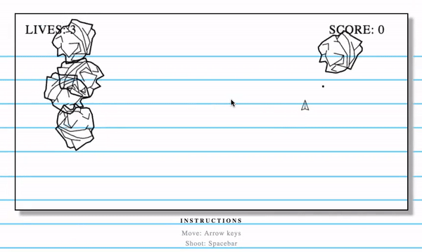

# Paper Droid

### About 

Paper Droid was inspired by the classic Asteroids game developed by Atari in 1979. In the original game a player controlled a ship to shoot asteroids. Paper Droid takes similar elements and makes the game into a fun spin off where the player controls a paper airplane and shoots at paper balls. Lives are lost upon collision with the paper ball targets and score is added when teh targets are destroyed. The game is over when the player loses all lives. 

### Gameplay 

Paper Droid is played using the arrow keys to move the paper airplane across the screen. Spacebar allows the player to fire bullets from the plane. 

The game relies heavily on collision. If a bullet collides with one of the targets the target will disappear and 10 points will be added to the score. If there is a collision between the plane and a target the player will lose a life and will spawn in the middle of the screen. 

If the player loses all lives the game is over and the player is able to press enter to be taken back to the start screen to play the game again. 